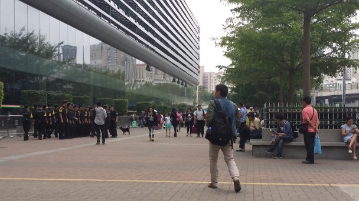

# Sample Dialog that the client expect

(It may be implemented in various form and not necessary to follow the exact output. Similar alternative can also be considered.)

Hi

> Welcome. What can I help you?

Want to ask something about your Hot Spring Tour.

> Yes. We have 5 similar tours.
> 1. 2D001	Shimen National Forest Tour 
> 2. 2D002	Yangshan Hot Spring Tour
> 3. 2D003	Heyuan Hotspring Tour
> 4. 3D075	Kaipinng culture tour 
> 5. 3D991	Qingyuan historic-landscape tour

May be 2 please.

> 2D002	Yangshan Hot Spring Tour* Unlimited use of hot spring * Famous Yangshan roaster cusine. 
> We have confirmed tour on 6/11, 15/11 
> We have tour on 13/11 still accept application.
> Fee: Weekday 299 / Weekend 399
> Do you want to book this one?

Yes.

> Which date you are going?

6/11.

> How many adults?

2

> How many children (Age 0 - 3) ?

0

> How many children (Age 4 to 11) ?

1

> It will be $717.6. Confirm?

Yes

> Thank you. Please pay the tour fee by ATM to 123-345-432-211 of ABC Bank or by cash in our store. When you complete the ATM payment, please send the bank in slip to us. Our staff will validate it.

Ok.
Can I also know where is the assembly point?

> We gather at the gathering spot  "Exit A, Futian port, Shenzhen" at 8:00AM on the departure date. We dismiss at the same spot after the tour.
>
> 

So how long it takes for me to go there from my home?

> Sorry, we don't have answer for this.

So will it rain on that day?

> Sorry, we don't have answer for this.

How about VISA?

> Please refer the Visa issue to the immigration department of China. The tour are assembled and dismissed in mainland and no cross-border is needed. However, you will need a travelling document when you check in the hotel.

Thank you

> Thank you.