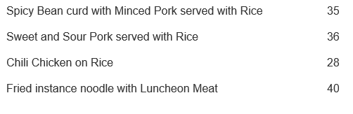
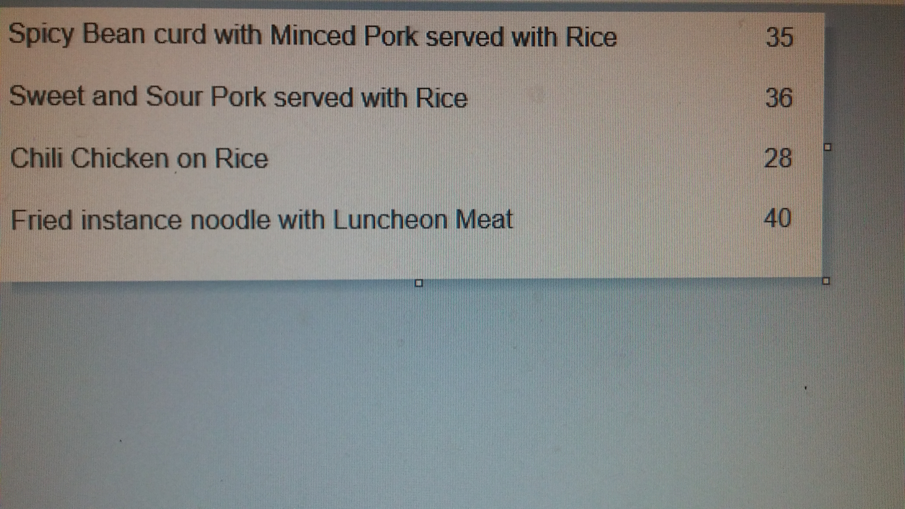

# Project Specification (for Topic 2)

You need to follow the following high-level requirements.

1) Project Objective

You need to develop a chatbot that assists a user to pick a lunch from a given menu. The selection shall be based on nurtient facts of foods, daily consumption of *Calories*, and other sustains such as *sodium* or *fat*, weight of the clients, and other factors that may be important to the user. The data and consumption guide are given to you as a reference. You are free to use it or use other source of references.

2) Acquiring user requirements.

You need to acquire your user requirements from real potential users. You need to hire 3 to 5 people who is not your group members to participate a focus group and they recognize they have a need of dieting. You need to acquire the consent from the users and state clear that their conversion may be recorded and submitted to TA for grading purpose. You also need to make sure the conversion are not disclosed elsewhere. To prove you have really conducted such focus group interview, you need to record at least 5 minutes of the conversation of the focus group and take a picture of the focus group. You may need to present these records to TA when necessary.

3) Number of features.

You should have at least 8 features. Proposed features must be relevant to the objective. Features with higher technical difficulty will be credited.

4) Menu format.

Your program should support menu inputted in the following format. Each time there would be 3 to 10 options.

* Plain text entered by the user
* URL entered by the user where provide menu in JSON format (see samples)
* For H students, also an image. (see samples)


5) Technologies should use.

* Database - ORM is preferrable
* Consumption of Restful Service [(see example)](https://spring.io/guides/gs/consuming-rest/)
* For H students, OCR (e.g [Asprise](https://github.com/Asprise/java-ocr-api))

With good reasons you are allowed not to use the above technologies, while "it has not been taught" is not a good reason.

---

# Initial ideas from the Marketing Department

## Ideas for all groups

1. Assist users to pick a food from a menu based on nutrient fact, users' weight, food ate in past few days.

1. Record the foods ate and the body weight in the past few days.

1. Compute calories/sodium/saturate fat of a food with database data.

1. Read menu from text.

1. Read menu from URL in JSON format.


## Additional Idea for COMP3111H groups

1. Read menu from JPEG.

## Nice to have features

1. Able to give recommendation in a more persuading way (reaons).

1. Able to give recommendation about portion size (how many to eat instead of what to eat)

1. Record and analysis multiple users eating habit and refine the recommendation system.

---


## Sample Menu

### Plain-text

* Spicy Bean curd with Minced Pork served with Rice 35
* Sweet and Sour Pork served with Rice 36
* Chili Chicken on Rice 28


### JSON 

```

[{
	"name":"Spicy Bean curd with Minced Pork served with Rice",
	"price":35,
	"ingredients":["Pork","Bean curd","Rice"]
},
{
	"name":"Sweet and Sour Pork served with Rice",
	"price":36,
	"ingredients":["Pork","Sweet and Sour Sauce","Pork"]
},
{
	"name":"Chili Chicken on Rice",
	"price":28,
	"ingredients":["Chili","Chicken","Rice"]
}]
```

### Image

Sample1



Sample2

